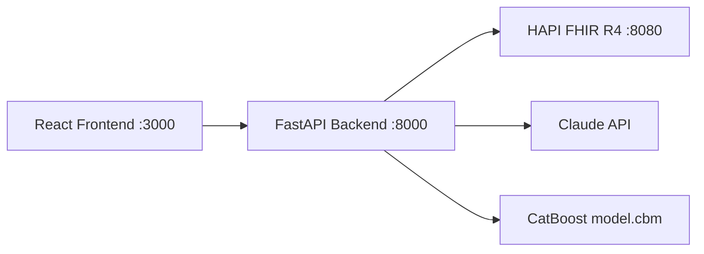

# PriorAI

Locally-runnable multimodal prior authorization agent

<!-- demo GIF goes here -->

## Quick Start (Docker)

```bash
git clone <repo>
cd prior-ai
cp .env.example .env   # add your ANTHROPIC_API_KEY
docker compose up --build
```
# then open http://localhost:3000
# first run: load patients
`docker exec prior-ai-backend python load_synthea.py`

## Quick Start (local dev)
Activate venv, `docker start hapi-fhir` (if already set up, or run docker to start HAPI FHIR standalone), `uvicorn backend.main:app --port 8000`, `cd frontend && npm run dev`. Note that `python load_synthea.py` must be run once after a fresh FHIR container.

## Demo Patients
Patient IDs are assigned dynamically by HAPI FHIR on load — use the patient dropdown in the UI or call `GET /patients` directly to see available IDs.

## Architecture


## Known Limitations
- CatBoost AUC is ~0.585 — DE-SynPUF denial labels are synthetic and noisy; the risk score is illustrative, not clinically validated.
- DE-SynPUF uses ICD-9 codes, Synthea uses ICD-10 — codes are treated as opaque categoricals by CatBoost; cross-coding accuracy is not guaranteed.
- HAPI FHIR data persists in a named Docker volume — if the volume is deleted, run `load_synthea.py` again.
- faster-whisper downloads its model on first use; ensure internet access on first audio transcription.
