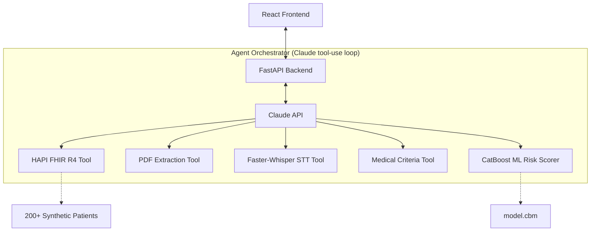

# PriorAI — Autonomous Prior Authorization Agent

**PriorAI** is a locally-runnable agentic AI assistant designed to automate the synthesis of clinical evidence for prior authorization (PA) workflows. It orchestrates a multi-source tool-use loop to gather patient data, evaluate medical necessity criteria, and estimate denial risk — transforming a 30-minute manual task into a sub-60-second automated summary.

---

## 🚀 Key Features

- **Autonomous Orchestration**: Uses an Anthropic Claude tool-use loop to dynamically query FHIR records, extract PDF clinical notes, and transcribe clinician voice memos.
- **Clinical Risk Intelligence**: Features a CatBoost classifier trained on **CMS E-SynPUF** synthetic claims data to predict the probability of denial, with **SHAP explainability** for clinician review.
- **EHR Integration**: Seamlessly connects to a **HAPI FHIR R4** server, with a cohort of **200+ synthetic patients** with realistic comorbidities.
- **Audit-First Design**: Produces a full **audit trace** of every tool call and clinical reasoning step, providing 100% transparency for administrative and clinical staff.
- **Full-Stack Performance**: A production-grade stack using **FastAPI** (Python), **React** (Vite), and **SSE (Server-Sent Events)** for real-time progress streaming.

---

## 🛠️ Tech Stack

- **Large Language Model**: [Anthropic Claude 3.5 Sonnet](https://www.anthropic.com/claude) (Orchestrator & Reasoning)
- **Machine Learning**: [CatBoost](https://catboost.ai/) (Risk Scoring) + [SHAP](https://github.com/shap/shap) (Explainability)
- **Data Layer**: [HAPI FHIR R4](https://hapifhir.io/) + [Synthea](https://synthea.mitre.org/)
- **Audio/PDF**: [faster-whisper](https://github.com/SYSTRAN/faster-whisper) (STT) + [pdfplumber](https://github.com/jsvine/pdfplumber) (Extraction)
- **Backend/Frontend**: FastAPI (Uvicorn) + React (Vite/Nginx)
- **Infrastructure**: Docker Compose

---

## 🏗️ Architecture



---

## 🚦 Quick Start

### 1. Requirements
- Docker & Docker Compose
- `ANTHROPIC_API_KEY` (set `CLAUDE_MODEL=claude-3-5-sonnet-latest` for best results)

### 2. Launch (3 Commands)
```bash
# Start the full stack (HAPI FHIR, Backend, Frontend)
docker compose up -d --build

# Load the synthetic patient cohort into HAPI FHIR
docker exec prior-ai-backend python load_synthea.py

# Access the UI
# Frontend: http://localhost:3000
# Backend: http://localhost:8000
```

---

## 📊 Technical Notes & Dataset

- **Training Data**: The denial-risk model was trained on the **CMS Medicare Claim Synthetic Public Use Files (DE-SynPUF)**.
- **Code Harmonization**: To bridge the gap between ICD-10 (Synthea) and ICD-9 (CMS SynPUF), CatBoost treats diagnosis and procedure codes as high-cardinality categorical features.
- **Performance**: Risk scores range from **0.21–0.85**, surfacing top denial drivers per case for proactive appeal drafting.
- **Synthetic Patient Cohort**: Generates 200+ patients with complex histories (diabetes, hypertension, renal failure) stored in local HAPI FHIR volumes.

---

## 📝 License & Purpose
This is a **demonstration/technical prototype** for educational and portfolio purposes. It uses entirely synthetic patient data and does not provide clinical advice or regulatory-approved medical determinations.
